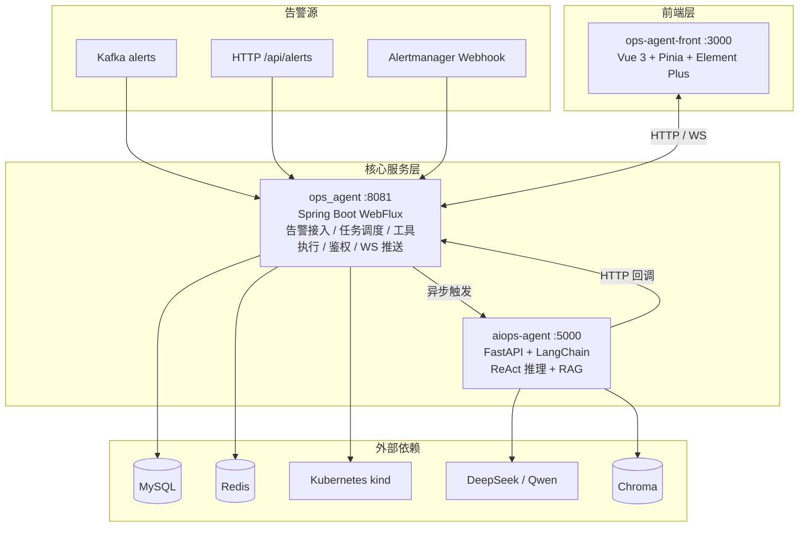

# AIOps 智能运维平台

基于 AI Agent + Spring Boot WebFlux + Vue 3 的智能运维平台，实现告警自动分析、根因定位与修复执行的全链路闭环。

[](https://www.oracle.com/java/)
[](https://spring.io/projects/spring-boot)
[](https://www.python.org/)
[](https://vuejs.org/)
[](LICENSE)
[](https://github.com/scwjsdgs/AiOps/actions/workflows/ci.yml)

---

## 1. 项目概述

传统运维模式下，告警触发后需要人工登录服务器排查日志、定位根因、手动执行修复，链路长、响应慢、容易出错。本项目构建了一套基于 AI Agent 的智能运维平台，将告警接入、AI 推理、K8s 真实操作、人工审批和实时推送整合为自动化闭环。

**核心逻辑**：告警进入平台后，由大模型进行多轮推理（查 K8s 状态 → 分析日志 → 执行重启/扩容/回滚 → 验证结果），最终输出运维报告。高危操作在执行前必须经过人工审批，确保安全可控。

**关键指标（本地 kind 演示环境实测）：**

| 指标 | 数值 |
|---|---|
| 单条告警平均推理轮次 | 3~5 轮（上限 8 轮） |
| 单次推理平均耗时 | 20~60 秒 |
| 工具调用成功率 | 约 95%（K8s 操作类） |
| 审批超时率 | 约 5%（manual 模式） |
| 告警到报告端到端耗时 | 30~90 秒 |

---

## 2. 整体架构

平台由三个核心模块与六类外部依赖组成。前端通过 HTTP 和 WebSocket 与 Java 中枢通信，Java 异步触发 Python 推理，Python 通过 HTTP 回调 Java 执行工具并回传结果。



## 核心模块

| 模块 | 技术栈 | 端口 | 职责 |
|------|--------|------|------|
| ops_agent | Java 21 + Spring Boot WebFlux | 8081 | 平台中枢：告警接入、任务调度、工具执行、鉴权、WebSocket 推送 |
| aiops-agent | Python + FastAPI + LangChain | 5000 | AI 大脑：ReAct 推理循环、RAG 知识库检索 |
| ops-agent-front | Vue 3 + Pinia + Element Plus | 3000 | 运维管理界面：告警管理、审批管理、任务监控、工具演练 |

## 外部依赖

| 依赖 | 接入模块 | 通信/协议 | 用途 |
|------|---------|-----------|------|
| MySQL | ops_agent | JDBC | 告警、审批、用户数据持久化 |
| Redis | ops_agent | Redis 读写 | 任务状态、审批队列、Webhook 幂等去重缓存 |
| Kafka | ops_agent | 消息消费 | 消费 `alerts` topic 接入告警消息 |
| Kubernetes | ops_agent | fabric8 / Kubernetes API | kind 集群，执行真实运维操作 |
| LLM | aiops-agent | OpenAI 兼容 API | DeepSeek/Qwen，提供推理能力 |
| Chroma | aiops-agent | 向量检索 | RAG 知识库，历史 SOP 检索 |

## 3. 核心特性
多源告警接入：支持 Kafka、HTTP API、Alertmanager Webhook 三种告警接入方式，统一进入 processAlert。

ReAct 推理引擎：基于 LangChain 实现多轮推理循环（最多 8 轮），自动决策工具调用。

真实 K8s 运维：通过 fabric8 客户端执行重启、扩缩容、回滚等真实运维操作。

四层安全防线：JWT 登录认证、内部 Token 认证、高危操作人工审批、防重复执行。

实时推送：基于 WebSocket 将推理过程与执行结果实时推送至前端。

RAG 知识库：基于 Chroma 向量库检索历史 SOP，知识库不可用时自动降级，不影响主链路。

4. 运行环境
组件	推荐版本	说明
JDK	21	ops_agent 使用 Java 21 + Spring Boot WebFlux
Python	3.10+	aiops-agent 使用 Python + FastAPI + LangChain
Node.js	18+ / 20	前端使用 Vue 3 + Vite
Maven	3.9+	Java 依赖构建
Docker	20+	用于启动 MySQL、Redis、Kafka
kind	0.20+	本地 Kubernetes 集群
注：若在 Linux / macOS 上运行，请自行调整 application.yml 与 .env 文件中的路径。Windows 环境下请确保 Docker 与 kind 已正确配置网络。

## 5. 快速启动（本地）

```bash
# 1. 启动基础依赖（MySQL、Redis、Kafka）
docker compose up -d

# 2. 创建本地 kind 集群
kind create cluster --name aiops
kubectl cluster-info

# 3. 配置环境变量
cp ops_agent/.env.example ops_agent/.env        # 修改 MYSQL_*、OPSAGENT_INTERNAL_TOKEN、OPSAGENT_WEBHOOK_TOKEN
cp aiops-agent/.env.example aiops-agent/.env    # 修改 LLM_API_KEY、JAVA_INTERNAL_TOKEN 等
# 前端已有 .env（VITE_API_BASE_URL=/api、VITE_WS_BASE_URL=ws://localhost:8081）

# 4. 启动 Java 后端
cd ops_agent
./mvnw spring-boot:run   # 端口 8081

# 5. 启动 Python AI 大脑
cd aiops-agent
python -m venv .venv
source .venv/bin/activate    # Windows 使用 .venv\Scripts\activate
pip install -r requirements.txt
uvicorn main:app --reload --port 5000   # 端口 5000

# 6. 启动前端
cd ops-agent-front
npm install
npm run dev   # 端口 3000
```
启动完成后，浏览器打开 http://localhost:3000 访问平台界面。
前端默认调用 http://localhost:8081（Java 后端）与 http://localhost:5000（Python AI 大脑）。

对于 CI 或生产环境，可直接使用 docker compose up -d 启动依赖服务。

6. API 参考（Java 后端）
所有 REST 接口均位于 /api 前缀。

路径	方法	说明
/api/alerts	POST	前端手动发送测试告警
/api/alerts/webhook	POST	接收 Alertmanager Webhook 真实告警
/api/tasks	GET	查看任务列表与推理轨迹
/api/approvals	GET	拉取待审批列表
/api/approvals/{id}/decision	POST	提交审批决策（APPROVED/REJECTED）
/api/tools/list	GET	查询已注册工具列表
/api/tools/execute	POST	手工执行工具（不受 Agent 白名单限制）
/api/agent/callback/*	POST	Python AI 大脑回调接口（step/tool/complete）
/ws/agent	WebSocket	实时推送推理步骤与最终结果
AI 大脑与后端的通信使用 X-Internal-Token 进行身份校验，令牌请在 ops_agent/application.yml 与 aiops-agent/.env 中保持一致。

7. 业务说明
告警接收：Java 后端通过 /api/alerts、Kafka 或 Webhook 接收告警，验证后落库 MySQL，并异步触发 Python AI 大脑。

ReAct 推理：Python 大脑在 ReAct 循环中调用 LLM 白名单内的 8 个工具：

- search_knowledge_base（RAG/Chroma 检索）
- get_status（查 K8s 状态）
- query_log（查日志）
- query_metrics（查 Prometheus 指标）
- query_pod_events（查 K8s 事件）
- restart_service（重启）/ clear_cache（清缓存）
- scale_up（扩缩容）
- rollback（回滚）
- request_human_approval（申请人工审批）

工具执行：Python 回调 Java，Java 校验白名单后真实操作 K8s（fabric8）或查日志（SSH）。`generic_command`（任意 shell）保留但永不暴露给 LLM。

人工审批：高危操作（回滚、扩容超阈值）阻塞等待前端审批，manual 模式最多 55 秒，超时视为拒绝。

自动巡检：Python 进程每天 8:00（或手动触发 `POST /api/agent/trigger_health_check`）执行全服务健康检查，结果通过 /api/agent/callback/complete 回传给 Java 后端。

前端展示：实时监控页面使用 WebSocket 订阅 taskId，展示各步骤、日志与执行结果；工具页面支持手动调用。

8. 贡献指南
Fork 本仓库。

从 main 创建 feature/xxx 分支。

在本地完成修改并通过测试（mvn test、pytest -q、npm run build）。

提交 PR，标题请遵循 feat: …、fix: … 规范。

CI 会自动运行，检查通过后由维护者 Review 合并。

详细规范请参阅 CONTRIBUTING.md。

9. 许可证
本项目基于 MIT License 开源。