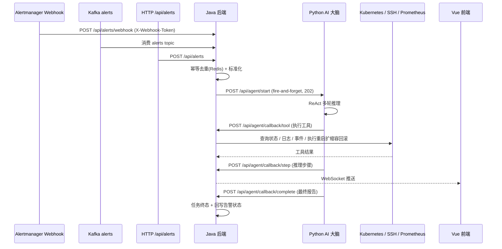

# 架构设计

## 整体架构

AIOps 平台由三层组成：

| 层级 | 组件 | 职责 |
|------|------|------|
| 前端层 | Vue 3 + Pinia + Element Plus | 可视化运维大盘、告警列表、任务监控、审批、工具演练、实时推理流 |
| 后端层 | Java (Spring Boot WebFlux) | 告警接入、任务调度、工具执行（K8s/SSH）、鉴权、WebSocket 推送 |
| AI 层 | Python (FastAPI + LangChain) | ReAct 推理循环、根因定位、修复建议、RAG 知识库检索 |

## 调用链路

告警从三条通道进入 Java 中枢，经统一处理（落库 MySQL + 建任务 + 通知 AI）后，由 AI 大脑做多轮推理，推理中通过回调执行真实运维工具，最终回传报告并实时推给前端。

```mermaid
sequenceDiagram
    participant AM as Alertmanager Webhook
    participant K as Kafka alerts
    participant H as HTTP /api/alerts
    participant J as Java 后端
    participant AI as Python AI 大脑
    participant K8s as Kubernetes / SSH / Prometheus
    participant Front as Vue 前端

    AM->>J: POST /api/alerts/webhook (X-Webhook-Token)
    K->>J: 消费 alerts topic
    H->>J: POST /api/alerts
    J->>J: 幂等去重(Redis) + 标准化
    J->>AI: POST /api/agent/start (fire-and-forget, 202)
    AI->>AI: ReAct 多轮推理
    AI->>J: POST /api/agent/callback/tool (执行工具)
    J->>K8s: 查询状态 / 日志 / 事件 / 执行重启扩缩容回滚
    K8s-->>J: 工具结果
    AI->>J: POST /api/agent/callback/step (推理步骤)
    J-->>Front: WebSocket 推送
    AI->>J: POST /api/agent/callback/complete (最终报告)
    J->>J: 任务终态 + 回写告警状态
```

## 模块说明

### AI 大脑（aiops-agent）

- 基于 FastAPI 暴露 HTTP 接口，启动时挂定时巡检协程（每天 8:00 全服务健康检查）。
- 使用 LangChain ReAct Agent 做多轮推理（默认上限 8 轮，受 `AGENT_MAX_ITERATIONS` 控制）。
- 支持 10 个工具：知识库检索、服务状态查询、日志分析、Pod 事件查询、Prometheus 指标查询、影响面分析、重启/清缓存、扩缩容、回滚、人工审批。
- 使用 Chroma 做向量检索（RAG），embedding 走阿里云百炼 DashScope 原生接口（`DASHSCOPE_API_KEY`），与 DeepSeek 对话模型相互独立。知识库不可用时自动降级工具，不阻断主链路。

### Java 后端（ops_agent）

- 基于 Spring Boot WebFlux（响应式），端口 8081。
- 告警接入：HTTP、Kafka、Alertmanager Webhook 三条通道统一进 `AlertIngestionService.processAlert`。
- 任务调度：Redis 存储任务（`task:*`，TTL 7 天），`TaskSchedulerService` 负责建任务/追加步骤/终态落库。
- 工具执行：`ToolRegistryService` 组件注册 11 个工具（含不暴露给 LLM 的 `generic_command`），LLM 仅能调用 `opsagent.tools.agent-exposed` 白名单（10 个）。
- WebSocket：`/ws/agent?taskId=xxx&token=JWT` 按 taskId 订阅，实时推送推理步骤与结果。
- Webhook：`AlertWebhookService` 负责解析、幂等去重、标准化、firing/resolved 分发；`@RateLimiter("webhook")` 限流。
- 鉴权：`JwtAuthenticationFilter`（JWT + 内部 Token + Webhook Token 三类放行策略）。
- 前瞻能力：`MetricBaselineService`（基线学习 + 预测性预警）、`TopologyService` + `ImpactAnalysisService`（影响面分析）、`RecoveryVerificationService`（修复后回归验证）。三者均复用 `AlertIngestionService.processAlert` 主链路，见 README §3.1。
- 集群查询：`ClusterStatusController` 暴露 `/api/cluster/{status,metrics,baseline,topology,impact}`，均为只读接口。

### 前端（ops-agent-front）

- Vue 3 + Vite + Pinia + Element Plus。
- 路由：Dashboard（/dashboard）、告警（/alerts）、审批（/approvals）、任务（/tasks）、工具（/tools）、实时监控（/realtime）。
- 通过 WebSocket 订阅 `taskId`，实时展示推理步骤（一键 AI 诊断 / 实时监控页）。
- Dashboard 展示最近 7 天告警趋势、级别分布（ECharts）、集群状态（K8s Deployment 实况）、
  指标大盘与**基线偏离卡片**（当前值 vs 学习到的 μ±3σ 区间）。
- 告警详情弹窗含**影响面关系图**（ECharts graph：Service→Pod，红色=断流 Service / 未就绪 Pod）。

## 外部依赖

| 依赖 | 接入模块 | 用途 |
|------|---------|------|
| MySQL | ops_agent | 告警、审批、用户数据持久化 |
| Redis | ops_agent | 任务状态、审批队列、Webhook 幂等去重缓存 |
| Kafka | ops_agent | 消费 `alerts` topic 接入告警 |
| Kubernetes (kind) | ops_agent | 执行真实运维操作（fabric8 客户端） |
| LLM (DeepSeek) | aiops-agent | OpenAI 兼容 API，提供对话/推理能力 |
| Embedding (DashScope) | aiops-agent | 阿里云百炼原生 text-embedding 接口，为 RAG 建库/检索编码向量 |
| Chroma | aiops-agent | RAG 知识库，历史 SOP 检索 |